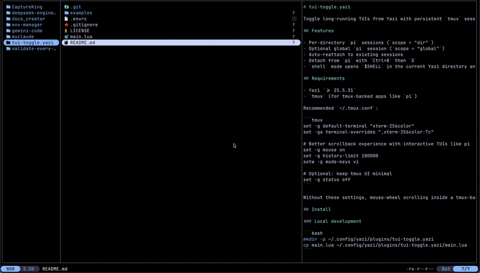

# tui-toggle.yazi

Toggle long-running TUIs from Yazi with persistent `tmux` sessions (starting with `pi`), plus a shell mode that opens in the current Yazi directory.



## Features

- Per-directory `pi` sessions (`scope = "dir"`)
- Optional global `pi` session (`scope = "global"`)
- Auto-reattach to existing sessions
- Detach from `pi` with `Ctrl+B` then `D`
- `shell` mode opens `$SHELL` in the current Yazi directory and returns on `exit`

## Requirements

- Yazi `>= 25.5.31`
- `tmux` (for tmux-backed apps like `pi`)

## Platform support

Current reality for this first release:

- **Tested:** macOS
- **Expected to work:** Linux (with `tmux` installed)
- **Untested:** Windows

Notes:

- `pi` mode depends on `tmux`.
- If you're on Windows, prefer using this plugin in WSL until native Windows behavior is validated.

### Ghostty note (macOS)

If `Shift+Enter` doesn't insert a newline in PI while running inside tmux, add this to your Ghostty config (`~/Library/Application Support/com.mitchellh.ghostty/config`):

```ini
# Map Shift+Enter to LF (Ctrl+J)
keybind = shift+enter=text:\x0a
```

Then restart Ghostty and restart tmux sessions (`tmux kill-server`).

Recommended `~/.tmux.conf`:

```tmux
set -g default-terminal "xterm-256color"
set -ga terminal-overrides ",xterm-256color:Tc"

# Pass modified keys (like Shift+Enter) through tmux
set -g xterm-keys on
set -s extended-keys on
set -as terminal-features ",xterm-256color:extkeys"

# Better scrollback experience with interactive TUIs like pi
set -g mouse on
set -g history-limit 100000
setw -g mode-keys vi

# Optional: keep tmux UI minimal
set -g status off
```

Without these settings, mouse-wheel scrolling inside a tmux-backed TUI can be captured by the app as input history navigation instead of tmux scrollback.

## Install

### Local development

```bash
mkdir -p ~/.config/yazi/plugins/tui-toggle.yazi
cp main.lua ~/.config/yazi/plugins/tui-toggle.yazi/main.lua
```

### After publishing

```bash
ya pkg add danchamorro/tui-toggle.yazi
```

## Session scopes

`tui-toggle` supports two session scopes for tmux-backed apps like `pi`:

- `scope = "dir"` (default): one session per directory (project-isolated)
- `scope = "global"`: one shared session reused across directories

Examples:

- `plugin tui-toggle -- pi` -> directory-scoped session (e.g. `pi-<hash>`)
- `plugin tui-toggle -- pi --scope=global` -> shared global session (`pi`)

## Keymaps

Add to `~/.config/yazi/keymap.toml`:

```toml
[[mgr.prepend_keymap]]
on   = ["g", "p"]
run  = "plugin tui-toggle -- pi"
desc = "Toggle pi (detach with Ctrl+B then D)"

[[mgr.prepend_keymap]]
on   = ["g", "G"]
run  = "plugin tui-toggle -- pi --scope=global"
desc = "Toggle global pi session"

[[mgr.prepend_keymap]]
on   = ["g", "t"]
run  = "plugin tui-toggle -- shell"
desc = "Open shell in current Yazi directory"
```

## Optional setup

In `~/.config/yazi/init.lua`:

```lua
require("tui-toggle"):setup({
	default_app = "pi",
	show_hints = true,
	apps = {
		pi = {
			cmd = "pi",
			tmux = true,
			scope = "dir",
			session_prefix = "pi",
			detach_hint = "Detach: Ctrl+B then D",
			env = { TERM = "xterm-256color" },
		},
		shell = {
			cmd = os.getenv("SHELL") or "sh",
			tmux = false,
			scope = "dir",
		},
	},
})
```

## Cleanup on Yazi exit

Yazi plugins do not provide a universal lifecycle hook for cleanup on process exit. Keep cleanup in your shell wrapper:

```bash
_cleanup_pi_tmux_sessions() {
  local session
  tmux list-sessions -F '#{session_name}' 2>/dev/null | while IFS= read -r session; do
    [[ "$session" == pi || "$session" == pi-* ]] || continue
    tmux kill-session -t "$session" 2>/dev/null
  done
}

yazi() {
  command yazi "$@"
  local exit_code=$?
  _cleanup_pi_tmux_sessions
  return $exit_code
}
```

## License

MIT
